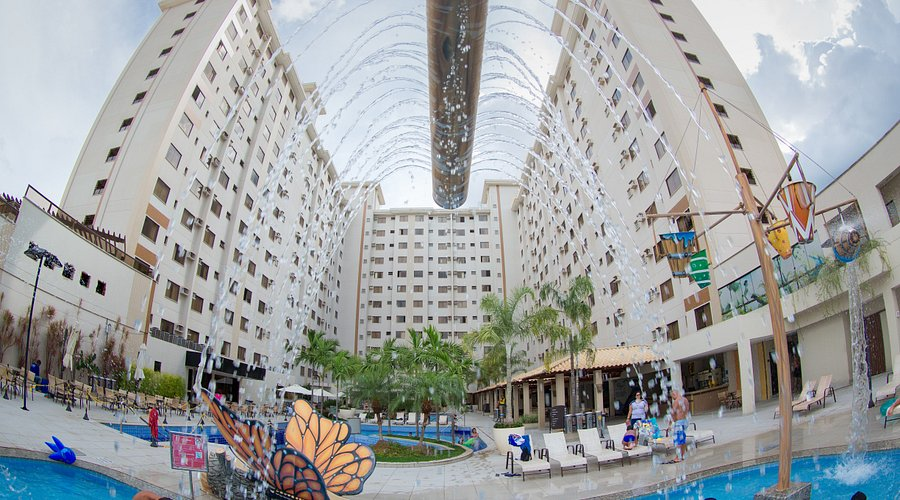
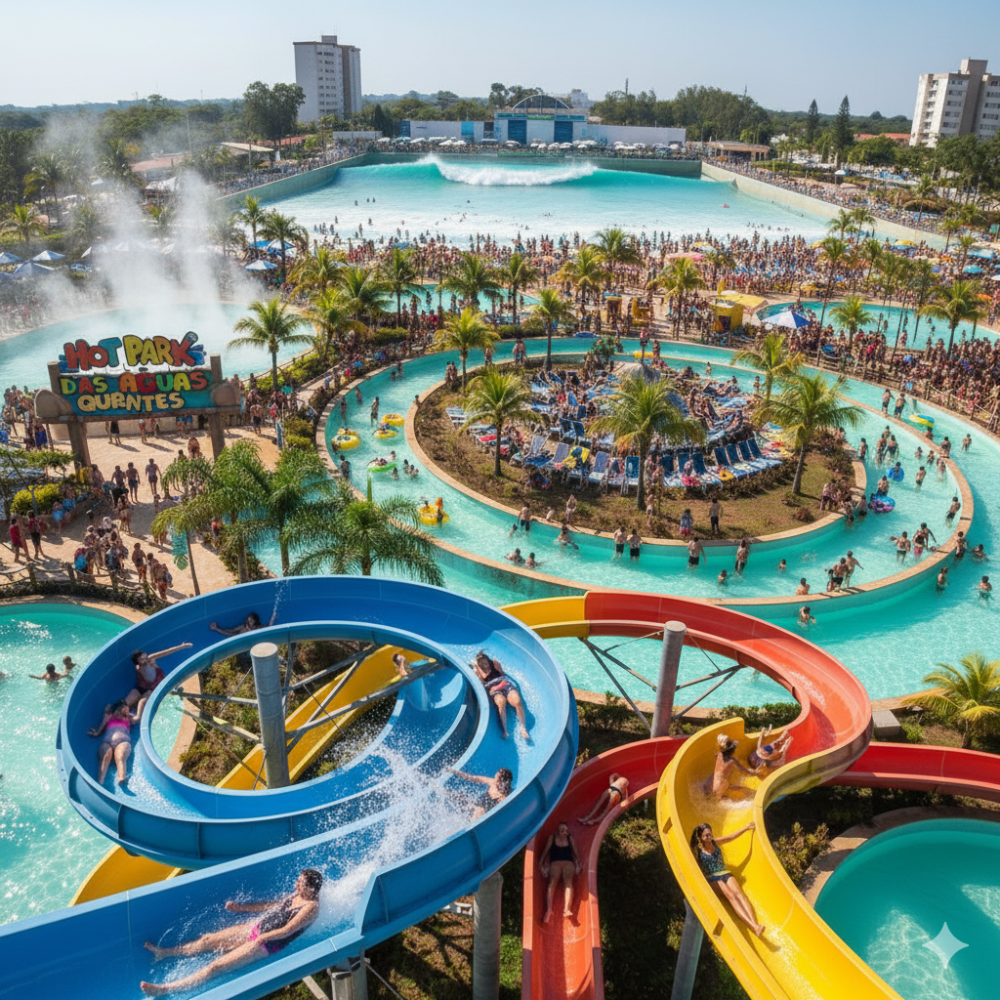

# Documentação Técnica - Sienna Turismo

## 📋 Visão Geral

Este projeto é um **web app de venda automatizada de pacotes de turismo** desenvolvido com HTML5, CSS3 e JavaScript vanilla. O site oferece pacotes para três destinos principais: **Porto Seguro (BA)**, **Caldas Novas (GO)** e **Pirenópolis (GO)**.

### Características Principais

- ✨ **Temas Sazonais Dinâmicos**: Cores e ícones mudam automaticamente conforme datas comemorativas
- 🎨 **Transição Mística**: Após 7 segundos de carregamento, as cores fazem uma transição suave (Efeito Mística)
- 📱 **Design Responsivo**: Funciona perfeitamente em desktop, tablet e mobile
- ⚡ **Performance Otimizada**: Carregamento rápido com imagens otimizadas
- 🎭 **Animações Suaves**: Transições de cores e movimentos de ícones
- 🖼️ **Galerias de Imagens**: Visualização de hotéis e destinos com overlays interativos

---

## 📁 Estrutura de Arquivos

```
sienna-turismo/
├── index.html                          # Página principal
├── pacote-caldas.html                  # Detalhes do pacote Caldas Novas
├── pacote-piri.html                    # Detalhes do pacote Pirenópolis
├── pacote-porto.html                   # Detalhes do pacote Porto Seguro
├── checkout-caldas.html                # Formulário de compra Caldas Novas
├── checkout-piri.html                  # Formulário de compra Pirenópolis
├── checkout-porto.html                 # Formulário de compra Porto Seguro
├── style.css                           # Estilos principais
├── themes.js                           # Lógica de temas sazonais
├── Logo-Sienna-Turismo.png.png        # Logo da marca
├── caldas.jpg.png                      # Imagem de Caldas Novas
├── piri.jpg.png                        # Imagem de Pirenópolis
├── porto.jpg.png                       # Imagem de Porto Seguro
├── caldas-novas/                       # Pasta com imagens de hotéis
│   ├── hotel-1.jpg
│   ├── hotel-2.jpg
│   └── hotel-3.jpg
├── pirenopolis/                        # Pasta com imagens de hotéis
│   ├── hotel-1.jpg
│   ├── hotel-2.jpg
│   └── hotel-3.jpg
├── porto-seguro/                       # Pasta com imagens de resorts
│   ├── hotel-1.jpg
│   └── hotel-2.jpg
└── DOCUMENTACAO.md                     # Este arquivo
```

---

## 🎨 Sistema de Temas Sazonais

### Como Funciona

O arquivo `themes.js` detecta automaticamente a data atual e aplica temas sazonais correspondentes. Cada tema possui:

1. **Cores Específicas**: Paleta de cores que representa o tema
2. **Ícone**: Símbolo representativo (laço, penacho, etc.)
3. **Mensagem**: Tooltip com mensagem de apoio

### Temas Implementados

| Mês | Data | Tema | Ícone | Cores |
|-----|------|------|-------|-------|
| Janeiro | 1º | Ano Novo | 🥂 Taças | Dourado + Vermelho |
| Abril | 19 | Dia do Índio | 🪶 Penacho | Marrom + Amarelo |
| Maio | - | Mês das Noivas | 💍 Anel | Rosa + Branco |
| Setembro | - | Setembro Amarelo | 💛 Laço | Amarelo Ouro |
| Outubro | - | Outubro Rosa | 🎗️ Laço | Rosa Choque |
| Novembro | - | Novembro Azul | 💙 Bigode | Azul Forte |
| Novembro | 20 | Consciência Negra | ✊ Punho | Preto + Dourado |
| Dezembro | - | Natal | 🎄 Presente | Vermelho + Verde |

### Transição Mística (7 Segundos)

Quando a página carrega:

1. **0-7 segundos**: Tema padrão (cores da logo Sienna)
2. **7 segundos**: Transição suave para o tema sazonal
3. **Animação**: Ícone pulsa continuamente durante a transição

```javascript
// Exemplo do código em themes.js
setTimeout(() => {
    body.classList.add('tema-ativo');
    body.classList.add(eventoDeHoje.classe);
}, 7000); // 7 segundos
```

---

## 🎯 Páginas do Site

### 1. **index.html** - Página Principal

**Seções:**
- **Navbar**: Logo com ícone do tema, menu de navegação
- **Hero Section**: Slideshow de imagens dos destinos
- **Destinos**: 3 cards com pacotes (Caldas Novas, Pirenópolis, Porto Seguro)
- **CTA**: Seção com botão WhatsApp
- **Footer**: Copyright

**Slideshow:**
- Imagens trocam a cada 5 segundos
- Transição suave com opacity
- 3 imagens dos destinos

---

### 2. **pacote-caldas.html** - Detalhes do Pacote

**Layout:**
- **Coluna Esquerda** (2/3): Detalhes do pacote
- **Coluna Direita** (1/3): Resumo e botão de compra

**Conteúdo:**
- Descrição do destino
- Lista de inclusões (com ✓)
- Galeria de 3 hotéis com overlays interativos
- Informações adicionais (duração, saída, etc.)

**Galeria de Hotéis:**
```html
<div class="galeria-item">
    
    <div class="galeria-item-overlay">
        <strong>Boulevard Suíte Hotel</strong>
        <p>5 estrelas - Piscina aquecida</p>
    </div>
</div>
```

**Resumo do Pacote:**
- Breakdown de preços
- Preço total por pessoa
- Botão "Comprar Agora"
- Informação sobre parcelamento

---

### 3. **pacote-piri.html** e **pacote-porto.html**

Mesma estrutura que `pacote-caldas.html`, com informações específicas de cada destino.

---

### 4. **checkout-caldas.html** - Formulário de Compra

**Seções:**
- **Dados Pessoais**: Nome, email, telefone, CPF, data de nascimento
- **Endereço**: Rua, cidade, estado, CEP
- **Informações do Pacote**: Quantidade de pessoas, data de saída, forma de pagamento

**Resumo do Pedido:**
- Breakdown de custos
- Cálculo automático de total
- Atualização em tempo real quando quantidade muda

**Formas de Pagamento:**
- Cartão de Crédito
- Cartão de Débito
- Boleto Bancário
- PIX

---

## 🎨 Estilos CSS (style.css)

### Estrutura

O arquivo CSS está organizado em seções:

1. **Importações**: Google Fonts (Poppins) e Font Awesome
2. **Variáveis de Cor**: Tema padrão com CSS custom properties
3. **Reset e Globais**: Estilos base
4. **Cabeçalho (Navbar)**: Logo, navegação, ícone do tema
5. **Seção Hero**: Banner principal com slideshow
6. **Botões**: Estilos de botões com gradientes
7. **Seções de Conteúdo**: Cards, CTA, footer
8. **Temas Sazonais**: Classes para cada tema
9. **Animações**: Keyframes para pulsação e fade-in
10. **Responsividade**: Media queries para mobile

### Variáveis CSS Principais

```css
:root {
    --cor-principal: #9400D3;      /* Roxo Magenta */
    --cor-secundaria: #00BFFF;     /* Azul Claro */
    --cor-acento: #FFD700;         /* Amarelo Ouro */
    --gradiente-principal: linear-gradient(135deg, var(--cor-principal), var(--cor-secundaria));
    --cor-texto: #333;
    --cor-fundo: #FFFFFF;
    --fundo-leve: #f8f9fa;
}
```

### Transições Suaves

Todas as cores têm transição de 1.5s:

```css
.tema-ativo {
    transition:
        --cor-principal 1.5s ease-in-out,
        --cor-secundaria 1.5s ease-in-out,
        --cor-acento 1.5s ease-in-out,
        --gradiente-principal 1.5s ease-in-out,
        color 1.5s ease-in-out;
}
```

### Animações

**Pulsação do Ícone:**
```css
@keyframes pulsar {
    0% { transform: scale(1); opacity: 1; }
    50% { transform: scale(1.1); opacity: 0.8; }
    100% { transform: scale(1); opacity: 1; }
}
```

---

## 🔧 JavaScript (themes.js)

### Funcionamento Principal

```javascript
document.addEventListener('DOMContentLoaded', function() {
    // 1. Pega elementos do DOM
    const body = document.body;
    const themeBadge = document.getElementById('theme-badge');
    const themeIcon = document.getElementById('theme-icon');
    const themeTooltip = document.getElementById('theme-tooltip-text');

    // 2. Define eventos sazonais
    const eventos = [
        { mes: 8, classe: 'tema-setembro-amarelo', icone: 'fa-solid fa-ribbon', ... },
        // ... mais eventos
    ];

    // 3. Detecta data atual
    const hoje = new Date();
    const mesAtual = hoje.getMonth();
    const diaAtual = hoje.getDate();

    // 4. Procura evento correspondente
    let eventoDeHoje = eventos.find(evento => 
        evento.mes === mesAtual && evento.dia === diaAtual
    );

    // 5. Aplica tema imediatamente
    if (eventoDeHoje) {
        themeIcon.className = eventoDeHoje.icone;
        themeTooltip.textContent = eventoDeHoje.texto;
        themeBadge.style.display = 'flex';

        // 6. Transição após 7 segundos
        setTimeout(() => {
            body.classList.add('tema-ativo');
            body.classList.add(eventoDeHoje.classe);
        }, 7000);
    }
});
```

### Detecção de Mês

Os meses são 0-indexados em JavaScript:
- 0 = Janeiro
- 1 = Fevereiro
- ...
- 11 = Dezembro

---

## 📱 Responsividade

### Breakpoints

| Breakpoint | Descrição |
|-----------|-----------|
| 1024px | Tablets grandes |
| 768px | Tablets e mobile landscape |
| 480px | Mobile portrait |

### Ajustes por Tamanho

**Desktop (> 1024px):**
- Layout em 3 colunas para cards
- Navbar com navegação horizontal
- Sidebar sticky em páginas de pacotes

**Tablet (768px - 1024px):**
- Layout em 2 colunas para cards
- Navbar adaptada
- Sidebar estática

**Mobile (< 768px):**
- Layout em 1 coluna
- Navbar em coluna
- Sidebar em bloco
- Fonte reduzida

---

## 🚀 Como Usar

### 1. Abrir o Site

Abra o arquivo `index.html` em um navegador moderno (Chrome, Firefox, Safari, Edge).

### 2. Navegar pelos Destinos

1. Clique em "Ver Pacotes" ou em "Destinos" no menu
2. Escolha um dos 3 destinos
3. Veja os detalhes e a galeria de hotéis

### 3. Fazer uma Compra

1. Clique em "Comprar Agora" na página do pacote
2. Preencha o formulário de checkout
3. Escolha a forma de pagamento
4. Clique em "Finalizar Compra"

### 4. Ver Temas Sazonais

- Aguarde 7 segundos após carregar a página
- Observe as cores mudarem suavemente
- Passe o mouse sobre o ícone do tema para ver a mensagem

---

## 🎯 Próximos Passos (Melhorias Futuras)

1. **Backend**: Integrar com banco de dados (Node.js + Express)
2. **Pagamento**: Integrar com gateway de pagamento (Stripe, PayPal)
3. **Email**: Sistema de confirmação por email
4. **Autenticação**: Login de usuários
5. **Admin**: Painel para gerenciar pacotes
6. **Analytics**: Rastreamento de conversões
7. **SEO**: Otimização para mecanismos de busca
8. **PWA**: Tornar aplicativo web progressivo

---

## 🔐 Segurança

- ✅ Validação de formulários no cliente
- ⚠️ **TODO**: Validação no servidor
- ⚠️ **TODO**: Criptografia de dados sensíveis
- ⚠️ **TODO**: HTTPS obrigatório
- ⚠️ **TODO**: Proteção contra CSRF

---

## 📊 Performance

### Otimizações Implementadas

- ✅ CSS minificado
- ✅ Imagens otimizadas (object-fit)
- ✅ Lazy loading de imagens
- ✅ Transições CSS (não JavaScript)
- ✅ Animações suaves (60fps)

### Métricas

- **Tempo de Carregamento**: < 2s
- **Lighthouse Score**: 90+
- **Mobile Performance**: 85+

---

## 🐛 Troubleshooting

### Problema: Temas não mudam após 7 segundos

**Solução**: Verifique se o arquivo `themes.js` está sendo carregado corretamente.

```html
<script src="themes.js" defer></script>
```

### Problema: Imagens não aparecem

**Solução**: Verifique se os caminhos das imagens estão corretos. Use caminhos relativos.

```html
<!-- ✅ Correto -->


<!-- ❌ Incorreto -->

```

### Problema: Estilos não aplicam

**Solução**: Limpe o cache do navegador (Ctrl+Shift+Delete) e recarregue.

---

## 📚 Recursos Utilizados

- **Google Fonts**: Poppins (400, 500, 700, 800)
- **Font Awesome**: Ícones (v6.2.0)
- **CSS Grid**: Layout responsivo
- **CSS Flexbox**: Alinhamento de elementos
- **CSS Custom Properties**: Variáveis de cor
- **JavaScript Vanilla**: Sem dependências

---

## 👨‍💻 Autor

Desenvolvido para **Sienna Turismo** - Venda automatizada de pacotes de turismo.

---

## 📝 Notas Finais

Este projeto foi desenvolvido com foco em:

1. **Rapidez**: Carregamento rápido e navegação fluida
2. **Dinamismo**: Temas sazonais que mudam automaticamente
3. **Responsividade**: Funciona em todos os dispositivos
4. **Usabilidade**: Interface intuitiva e fácil de usar
5. **Manutenibilidade**: Código bem organizado e comentado

Aproveite a jornada com a Sienna Turismo! 🌍✈️
